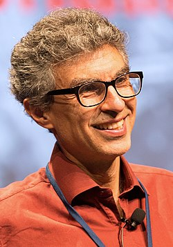

<table class="infobox biography vcard">
<tbody>
<tr>
<th colspan="2">

Yoshua Bengio

 

<a title="Fellow of the Royal Society" href="https://en.wikipedia.org/wiki/Fellow_of_the_Royal_Society">FRS</a>&nbsp;<a title="Order of Canada" href="https://en.wikipedia.org/wiki/Order_of_Canada">OC</a>&nbsp;<a title="Fellow of the Royal Society of Canada" href="https://en.wikipedia.org/wiki/Fellow_of_the_Royal_Society_of_Canada">FRSC</a>

</th>
</tr>
<tr>
<td colspan="2">

Yoshua Bengio in 2017

</td>
</tr>
<tr>
<th scope="row">Born</th>
<td>1964 (age&nbsp;55&ndash;56) 

<a title="Paris" href="https://en.wikipedia.org/wiki/Paris">Paris</a>,&nbsp;<a title="France" href="https://en.wikipedia.org/wiki/France">France</a>

</td>
</tr>
<tr>
<th scope="row">Citizenship</th>
<td class="category"><a title="Canada" href="https://en.wikipedia.org/wiki/Canada">Canada</a></td>
</tr>
<tr>
<th scope="row">Alma&nbsp;mater</th>
<td><a title="McGill University" href="https://en.wikipedia.org/wiki/McGill_University">McGill University</a></td>
</tr>
<tr>
<th scope="row">Known&nbsp;for</th>
<td><a title="Deep learning" href="https://en.wikipedia.org/wiki/Deep_learning">Deep learning</a>,&nbsp;<a title="Neural machine translation" href="https://en.wikipedia.org/wiki/Neural_machine_translation">neural machine translation</a>,&nbsp;<a class="mw-redirect" title="Generative adversarial networks" href="https://en.wikipedia.org/wiki/Generative_adversarial_networks">generative adversarial networks</a>,<a class="external text" href="https://towardsdatascience.com/intuitive-understanding-of-attention-mechanism-in-deep-learning-6c9482aecf4f" rel="nofollow">"attention model"</a>,&nbsp;<a title="Word embedding" href="https://en.wikipedia.org/wiki/Word_embedding">word embeddings</a>,&nbsp;<a title="Deep learning" href="https://en.wikipedia.org/wiki/Deep_learning#Stacked_(de-noising)_auto-encoders">denoising auto-encoders</a>,&nbsp;<a title="Language model" href="https://en.wikipedia.org/wiki/Language_model">neural language models</a>,&nbsp;<a class="mw-redirect" title="Learning to learn" href="https://en.wikipedia.org/wiki/Learning_to_learn">learning to learn</a></td>
</tr>
<tr>
<th scope="row">Awards</th>
<td><a title="Prix Marie-Victorin" href="https://en.wikipedia.org/wiki/Prix_Marie-Victorin">Marie-Victorin Prize</a>&nbsp;(2017) <a title="Turing Award" href="https://en.wikipedia.org/wiki/Turing_Award">Turing Award</a>&nbsp;(2018) <a title="AAAI Fellow" href="https://en.wikipedia.org/wiki/AAAI_Fellow">AAAI Fellow</a>&nbsp;(2019)</td>
</tr>
<tr>
<td colspan="2"><strong>Scientific career</strong></td>
</tr>
<tr>
<th scope="row">Fields</th>
<td class="category"><a title="Computer science" href="https://en.wikipedia.org/wiki/Computer_science">Computer science</a></td>
</tr>
<tr>
<th scope="row">Institutions</th>
<td><a title="Universit&eacute; de Montr&eacute;al" href="https://en.wikipedia.org/wiki/Universit%C3%A9_de_Montr%C3%A9al">Universit&eacute; de Montr&eacute;al</a></td>
</tr>
<tr>
<th scope="row"><a title="Thesis" href="https://en.wikipedia.org/wiki/Thesis">Thesis</a></th>
<td><a class="external text" href="http://digitool.library.mcgill.ca/R/-?func=dbin-jump-full&amp;object_id=70220&amp;silo_library=GEN01" rel="nofollow"><em>Artificial Neural Networks and their Application to Sequence Recognition</em></a>&nbsp;(1991)</td>
</tr>
<tr>
<th scope="row"><a title="" href="https://en.wikipedia.org/wiki/Doctoral_advisor">Doctoral advisor</a></th>
<td>Renato de Mori</td>
</tr>
<tr>
<th scope="row">Notable students</th>
<td><a title="Ian Goodfellow" href="https://en.wikipedia.org/wiki/Ian_Goodfellow">Ian Goodfellow</a></td>
</tr>
<tr>
<th scope="row">Website</th>
<td><a class="external text" href="http://www.iro.umontreal.ca/~bengioy/" rel="nofollow">iro.umontreal.ca/~bengioy</a></td>
</tr>
</tbody>
</table>
 

<strong>Yoshua Bengio</strong>&nbsp;<a title="Fellow of the Royal Society" href="https://en.wikipedia.org/wiki/Fellow_of_the_Royal_Society">FRS</a>&nbsp;<a title="Order of Canada" href="https://en.wikipedia.org/wiki/Order_of_Canada">OC</a>&nbsp;<a title="Fellow of the Royal Society of Canada" href="https://en.wikipedia.org/wiki/Fellow_of_the_Royal_Society_of_Canada">FRSC</a>&nbsp;(born 1964 in&nbsp;<a title="Paris" href="https://en.wikipedia.org/wiki/Paris">Paris</a>,&nbsp;<a title="France" href="https://en.wikipedia.org/wiki/France">France</a>) is a Canadian&nbsp;<a title="Computer science" href="https://en.wikipedia.org/wiki/Computer_science">computer scientist</a>, most noted for his work on&nbsp;<a class="mw-redirect" title="Artificial neural networks" href="https://en.wikipedia.org/wiki/Artificial_neural_networks">artificial neural networks</a>&nbsp;and&nbsp;<a title="Deep learning" href="https://en.wikipedia.org/wiki/Deep_learning">deep learning</a>.&nbsp;He was a co-recipient of the 2018&nbsp;<a title="Turing Award" href="https://en.wikipedia.org/wiki/Turing_Award">ACM A.M. Turing Award</a>&nbsp;for his work in deep learning.&nbsp;He is a professor at the Department of Computer Science and Operations Research at the&nbsp;<a title="Universit&eacute; de Montr&eacute;al" href="https://en.wikipedia.org/wiki/Universit%C3%A9_de_Montr%C3%A9al">Universit&eacute; de Montr&eacute;al</a>&nbsp;and scientific director of the&nbsp;<a class="mw-redirect" title="Montreal Institute for Learning Algorithms" href="https://en.wikipedia.org/wiki/Montreal_Institute_for_Learning_Algorithms">Montreal Institute for Learning Algorithms</a>&nbsp;(MILA). Bengio, together with&nbsp;<a title="Geoffrey Hinton" href="https://en.wikipedia.org/wiki/Geoffrey_Hinton">Geoffrey Hinton</a>&nbsp;and&nbsp;<a title="Yann LeCun" href="https://en.wikipedia.org/wiki/Yann_LeCun">Yann LeCun</a>, are referred to by some as the "Godfathers of AI" and "Godfathers of Deep Learning".

 

<h2>Top 5 Papers By Turing Award Winner Yoshua Bengio That Push The Boundaries Of AI</h2>

<ul>

                             

 <li><a target="_blank" href="https://github.com/manjunath5496/Top-5-Papers-By-Turing-Award-Winner-Yoshua-Bengio-That-Push-The-Boundaries-Of-AI/blob/master/bengio(1).pdf" style="text-decoration:none;">Learning Long-Term Dependencies With Gradient Descent Is Difficult</a></li>

 <li><a target="_blank" href="https://github.com/manjunath5496/Top-5-Papers-By-Turing-Award-Winner-Yoshua-Bengio-That-Push-The-Boundaries-Of-AI/blob/master/bengio(2).pdf" style="text-decoration:none;">Convolutional Networks For Images, Speech, And Time Series</a></li>

<li><a target="_blank" href="https://github.com/manjunath5496/Top-5-Papers-By-Turing-Award-Winner-Yoshua-Bengio-That-Push-The-Boundaries-Of-AI/blob/master/bengio(3).pdf" style="text-decoration:none;">Gradient Based Learning Applied to Document Recognition</a></li>
 <li><a target="_blank" href="https://github.com/manjunath5496/Top-5-Papers-By-Turing-Award-Winner-Yoshua-Bengio-That-Push-The-Boundaries-Of-AI/blob/master/bengio(4).pdf" style="text-decoration:none;">Learning Deep Architectures for AI</a></li>                              
<li><a target="_blank" href="https://github.com/manjunath5496/Top-5-Papers-By-Turing-Award-Winner-Yoshua-Bengio-That-Push-The-Boundaries-Of-AI/blob/master/bengio(5).pdf" style="text-decoration:none;">Neural Machine Translation by Jointly Learning To Align And Translate</a></li>

</ul>
